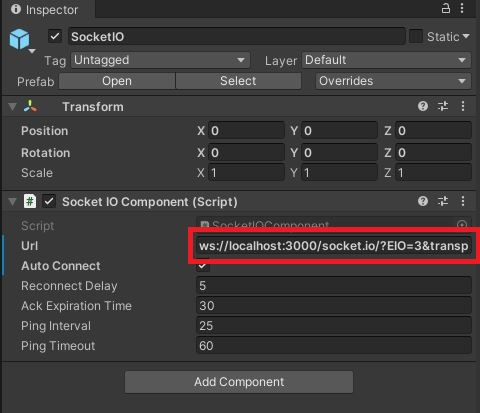
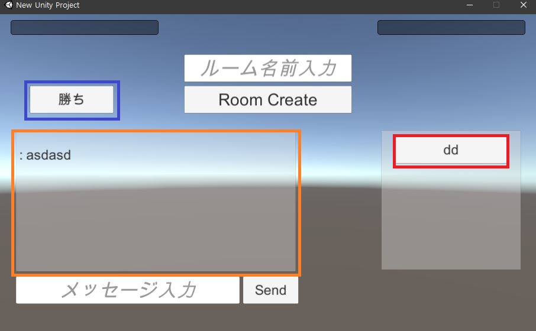

# SocketIOとUnityで利用したネットワーク通信ゲーム
## 使用言語
Node.js, C#
## 実行環境
Unity 2019.4.15f1  
Nodejs v14.15.0  
## 使用module(Server)
socketio 1.0.0  
uuid 8.3.2  
express 4.17.1  
http 0.0.1-security  
## 使用ライブラリ(Client)
SocketIO for Unity - v1.0.0(https://github.com/vedi/unity-socket.io)

# directory Path
```
UnityServer
│  .gitignore
│  README.md
│  
├─.vs
└─serverTest
    ├─Build
    ├─Client
    └─Server
        │  .gitignore
        │  index.js
        │  package-lock.json
        │  package.json
        │  php_deployment.sh
        │  tesdt.txt
        │  test.php
        │  
        └─node_modules
```

# server実行
```bash
cd <your Path>/UnityServer/Server
node index.js
//実行画面=====================================================
URL = ws://localhost:3000/socket.io/?EIO=4&transport=websocket
```

# Client実行
## 接続したいIPを変更したい場合は
<center></center>

赤いbox : ws://**localhost**:3000/socket.io/?EIO=4&transport=websocket  
localhostのみ自分が変更したいなIPを変更

## Title画面(Client1)
<center></center>

赤いbox : Roomの名前入力してRoom Create **Button**を押すとゲームに入る。  
黄色box : Messageを入力してSend **Button**を押すとMassageをServerに**送信**する。  

## Title画面(Client2)
<center></center>

赤いbox : 生成されたRoom Listが表示してその**Button**を押すとゲームに入る。  
黄色box : Serverから**送信**されたMassageがあったらMassage内容を表示する。  

## Game画面(待機)
<center></center>

赤いbox : Player1のUUIDを表示(先にRoomに入れたClient)  
黄色box : Player2のUUIDを表示(後にRoomに入れたClient)  **空白**ならまだPlayerは入れてない状態  
Client1は別のClient2が入るまでに待機する。  

## Game画面(プレイ)
<center>


</center>
<center>左）Client1 : 右）Client2</center>

赤いbox : 相手(Clientによって違って見える)  
青いbox : 自分(Clientによって違って見える)  
黄色box : Scoreが5になったPlayerが勝利  
紫box : Ball

### 説明
基本的にPongゲームみたいなゲームになるます。Ballが右左の画面の外に出したら画面の方によってSoreが上がります。  
そして先にSoreが5になったPlayerが勝利になります。**(今はTitle画面に戻る)**

### 操作系（キーボード）
Wキーで上に移動、Sキーで下に移動 **(画面内だけ移動可能)**